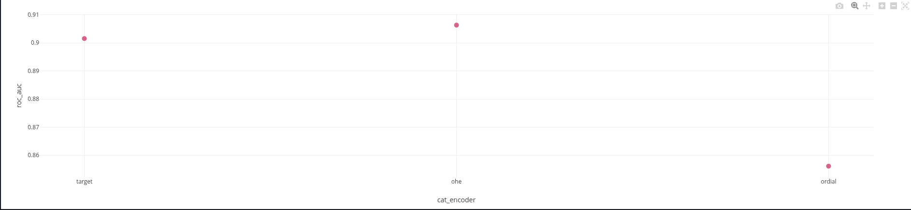
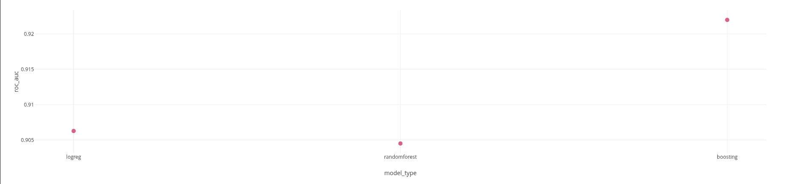
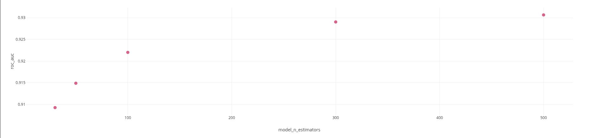
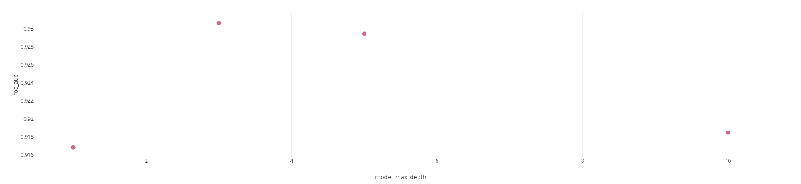

# Эксперимент 1
### Гипотеза:
- Тип кодирования категориальных признаков влияет на качество итоговой модели.

### Параметр:
- `ordial`/`onehot`/`target` энкодеры для кодирования категориальных фичей.

### Итог:

на графике отложены значения метрик roc_auc (по оси Y) от используемого вида категориального кодирования ordial/onehot/target.

### Вывод:
- Тип кодирования **влияет** на качество модели. Максимум (0.906 vs 0.902/0.856) достигается при **one hot энкодинге**. Фиксируем onehot энкодинг.

# Эксперимент 2
### Гипотеза:
- Архитектура модели влияет на качество предсказаний.

### Параметр:
- Тип модели `LogReg`/`RandomForest`/`BoostingClassifier`.

### Итог:

на графике отложены значения метрик roc_auc (по оси Y) от используемого типа архитектуры модели LogReg/RandomForest/BoostingClassifier.

### Вывод:
- Архитектура модели **влияет** на качество предсказаний. Максимум (0.922 vs 0.906/0.905) достигается при использовании архитектуры **бустинга**. Фиксируем архитектуру модели - бустинг.

# Эксперимент 3
### Гипотеза:
- Число деревьев в бустинге влияет на качество предсказаний.

### Параметр:
- `n_estimators` в GradientBoostingClassifier перебирается по списку [10, 30, 50, 100, 300, 500]

### Итог:

на графике отложены значения метрик roc_auc (по оси Y) от числа деревьев (n_estimators) при обучении BoostingClassifier.

### Вывод:
- Количество деревьев **влияет** на качество предсказаний. Максимум (0.931 vs 0.929/0.922/0.915/0.909) достигается при использовании **500 деревьев**. Фиксируем `n_estimators` равным 500.

# Эксперимент 4
### Гипотеза:
- Глубина деревьев в бустинге влияет на качество предсказаний.

### Параметр:
- `max_depth` в GradientBoostingClassifier перебирается по списку [1, 3, 5, 10]

### Итог:

на графике отложены значения метрик roc_auc (по оси Y) от максимальной глубины деревьев (max_depth) при обучении BoostingClassifier.

### Вывод:
- Глубина деревьев **влияет** на качество предсказаний. Максимум (0.931 vs 0.929/0.917/0.918) достигается при использовании **глубины 3**. Фиксируем `max_depth` раным 3.