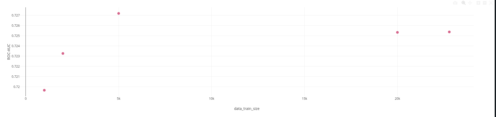
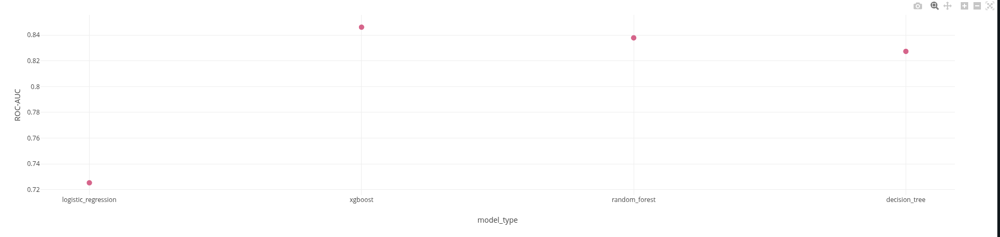
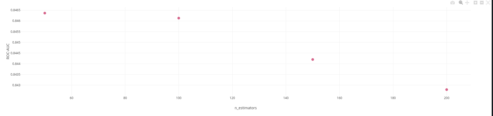
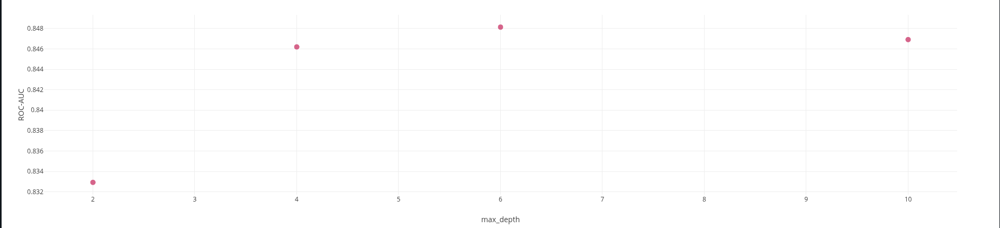

# Эксперимент 1
### Гипотеза:
- Размер обучающей выборки влияет на качество модели.

### Параметр:
- Размер обучающей выборки перебирается по сетке [1000, 2000, 5000, 20_000, all_data]

### Итог:

на графике отложены значения метрик roc_auc (по оси Y) от размера обучающей выборки.

### Вывод:
- Размер выборки несильно, но **влияет** на качество модели (если взять слишком малденькую выборку, то теряем в качестве, различия на бОльшем числе данных можно счиатать случайностью). Максимум (0.727 vs 0.725/0.725/0.723/0.720) достигается при значениях выборки больше 5000 сэмплов, автор останавливается на варианте с использованием всей выборки.

# Эксперимент 2
### Гипотеза:
- Архитектура модели влияет на качество предсказаний.

### Параметр:
- Тип модели `LogReg`/`RandomForest`/`DecisionTree`/`XGboost`.

### Итог:

на графике отложены значения метрик roc_auc (по оси Y) от используемого типа архитектуры модели LogReg/RandomForest/DecisionTree/XGboost.

### Вывод:
- Архитектура модели **влияет** на качество предсказаний. Максимум (0.846 vs 0.838/0.827/0.725) достигается при использовании архитектуры **бустинга**. Далее автор фиксирует архитектуру модели - XGboost.

# Эксперимент 3
### Гипотеза:
- Число деревьев в бустинге влияет на качество предсказаний.

### Параметр:
- `n_estimators` в XGboost перебирается по списку [50, 100, 150, 200]

### Итог:

на графике отложены значения метрик roc_auc (по оси Y) от числа деревьев (n_estimators) при обучении XGboost.

### Вывод:
- Количество деревьев **влияет** на качество предсказаний. Максимум (0.846 vs 0.844/0.0843) достигается при использовании **50/100 деревьев**. Далее автор фиксирует `n_estimators` равное 100.

# Эксперимент 4
### Гипотеза:
- Глубина деревьев в бустинге влияет на качество предсказаний.

### Параметр:
- `max_depth` в XGboost перебирается по списку [2, 4, 6, 10]

### Итог:

на графике отложены значения метрик roc_auc (по оси Y) от максимальной глубины деревьев (max_depth) при обучении XGboost.

### Вывод:
- Глубина деревьев **влияет** на качество предсказаний. Максимум (0.848 vs 0.847/0.846/0.833) достигается при использовании **глубины 6**. Далее автор не приводит финальный ран с подобранными параметрами, поэтому точно сказать какой параметр был зафиксирован не удается.

# Итоговый ран по итогу экспериментов

Отдельно не приведен, возможно, итоговым считается этот ран:

http://158.160.2.37:5000/#/experiments/3/runs/883bae4f6ec147a081fd7e5a53ff8e20
